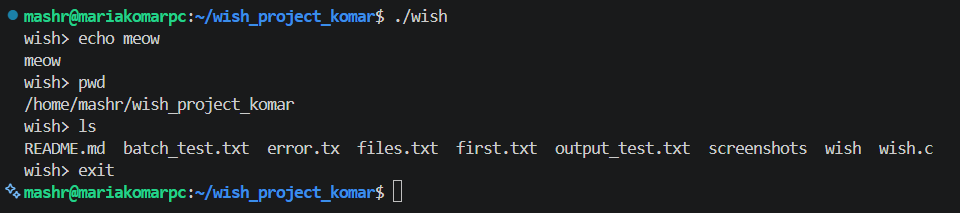
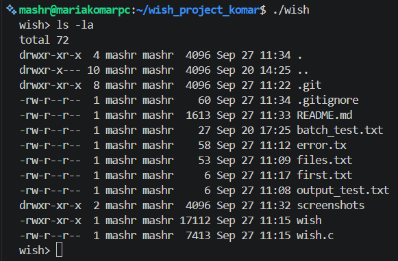
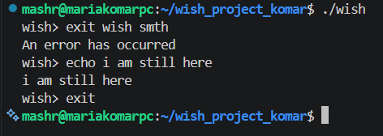
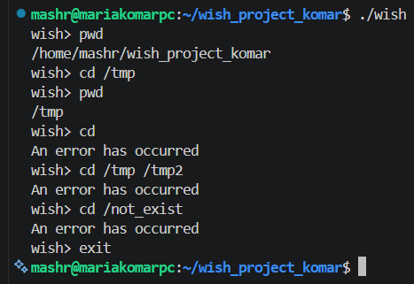
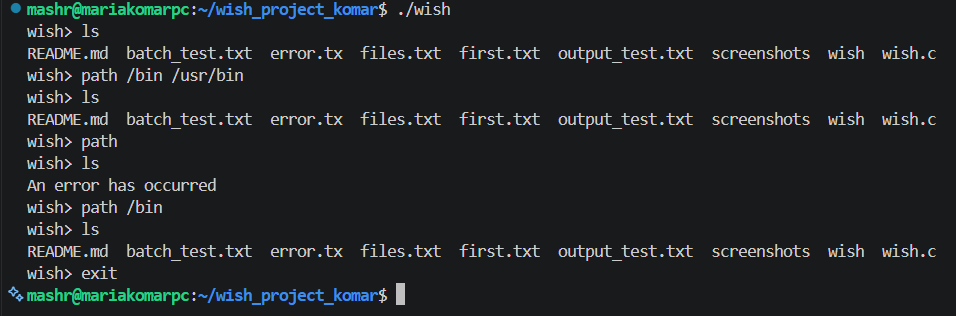
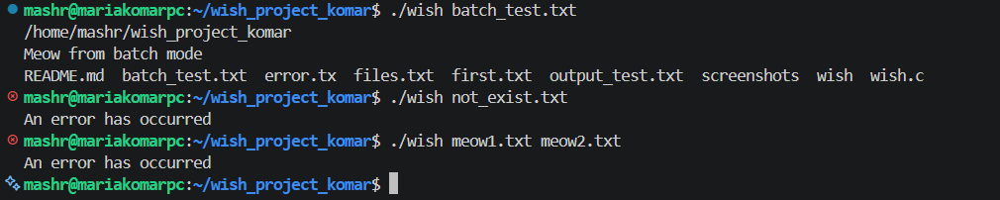
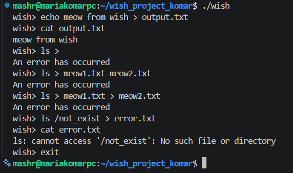
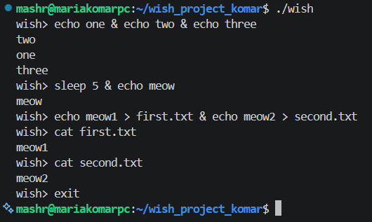
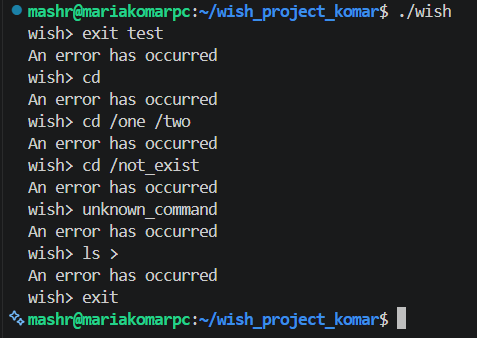

# Unix Shell — wish

## Опис проєкту

`wish` — це спрощена Unix-оболонка командного рядка, реалізована мовою C.

Програма підтримує:

- інтерактивний режим;
- пакетний режим;
- запуск зовнішніх команд;
- вбудовані команди `exit`, `cd`, `path`;
- пошук виконуваних файлів;
- перенаправлення виводу через `>`;
- паралельний запуск команд через `&`;
- обробку помилок.

## Використані технології

- C
- GCC
- Linux / Ubuntu
- WSL
- Visual Studio Code
- Git
- GitHub

Основні системні виклики:

- `fork()`
- `execv()`
- `wait()`
- `waitpid()`
- `chdir()`
- `access()`
- `open()`
- `dup2()`

## 1. Інтерактивний режим

Якщо програму запустити без додаткових аргументів:

```bash
./wish
```

Вона працює в інтерактивному режимі.На екрані з’являється запрошення:
wish>.
Після цього користувач може вводити команди по одній.
Для читання команд у програмі використовується функція getline().
Інтерактивний цикл працює доти, доки користувач не введе команду exit або не буде отримано EOF.


## 2. Запуск зовнішніх команд

Команди `ls`, `pwd`, `echo`, `cat` та інші не реалізовані безпосередньо в `wish`.

Shell знаходить відповідний виконуваний файл у директоріях із `path`, створює дочірній процес і запускає програму.

Для цього використовуються системні виклики:

- `fork()` — створює дочірній процес;
- `execv()` — запускає знайдений executable у дочірньому процесі;
- `wait()` / `waitpid()` — очікує завершення дочірнього процесу.

Наприклад, якщо користувач вводить:

```text
wish> ls
``` 

shell шукає виконуваний файл:/bin/ls. Після введення зовнішньої команди `wish` спочатку створює дочірній процес за допомогою `fork()`. У дочірньому процесі викликається `execv()`, який запускає знайдену програму, наприклад `/bin/ls`. Батьківський процес `wish` при цьому не завершується. Він очікує завершення дочірнього процесу за допомогою `wait()` або `waitpid()`. Після завершення команди керування повертається до shell, і користувач знову може вводити наступну команду.


## 3. Вбудована команда `exit`

Команда `exit` використовується для завершення роботи shell.

На відміну від зовнішніх команд, `exit` не запускається через `fork()` та `execv()`. Вона обробляється безпосередньо всередині програми `wish`.
Правильний виклик:
```text
wish> exit
```

Після цього програма завершує роботу.

Команда exit не повинна мати додаткових аргументів.У цьому випадку shell виводить повідомлення про помилку і продовжує роботу.


## 4. Вбудована команда `cd`

Команда `cd` використовується для зміни поточної робочої директорії shell.
Вона реалізована за допомогою системного виклику `chdir()`.

Правильний виклик:
```text
wish> cd /tmp
```
Після цього поточна директорія змінюється.
Перевірити це можна командою:
```text
wish> pwd
```
Команда cd повинна отримувати рівно один аргумент - інакше буде виникати помилка.


## 5. Вбудована команда `path`

Команда `path` використовується для керування списком директорій, у яких `wish` шукає виконувані файли.

Початково shell використовує:
```text
/bin
```

Наприклад, якщо користувач вводить:
```text
wish> ls
```
програма формує шлях: /bin/ls і перевіряє, чи існує такий виконуваний файл. Для перевірки використовується системний виклик `access()`. Команда `path` може повністю замінити список директорій пошуку.

Наприклад:
```text
wish> path /bin /usr/bin
```
Після цього shell буде шукати програми спочатку в /bin, а потім у /usr/bin.
Якщо виконати:
```text
wish> path
```
список шляхів стає порожнім.
У такому випадку зовнішні команди більше не можуть бути знайдені:
```text
wish> path
wish> ls
An error has occurred
```
При цьому вбудовані команди продовжують працювати.
Для відновлення можливості запуску зовнішніх команд можна знову встановити шлях:
```text
wish> path /bin
```


## 6. Пакетний режим (Batch Mode)

Окрім інтерактивного режиму, `wish` підтримує пакетний режим.
У цьому режимі команди зчитуються не з клавіатури, а з текстового файлу.
Наприклад, файл batch_test.txt може містити:
```text
pwd
echo Meow from batch mode
ls
```
Для запуску shell у пакетному режимі використовується команда:
```text
./wish batch_test.txt
```
У цьому режимі wish послідовно зчитує та виконує всі команди з файлу.
На відміну від інтерактивного режиму, prompt: wish> не виводиться.
Якщо вказати файл, якого не існує shell виведе: An error has occurred.
Також помилкою є запуск wish із більш ніж одним аргументом.


## 7. Перенаправлення виводу через `>`

Оператор `>` використовується для перенаправлення результату виконання команди у файл.
Наприклад:
```text
wish> echo meow > output.txt
```
У цьому випадку текст meow не виводиться у термінал, а записується у файл output.txt.
Перевірити результат можна командою:
```text
wish> cat output.txt
meow
```
Для роботи перенаправлення використовуються системні виклики:
- open() — відкриває або створює файл;
- dup2() — перенаправляє стандартний вивід та стандартний потік помилок у файл;
- close() — закриває файловий дескриптор.

У реалізації перенаправляються обидва потоки:
- stdout
- stderr
Тому у файл можуть записуватися не лише звичайні результати команди, а й повідомлення про помилки.

Якщо файл уже існує, його попередній вміст замінюється новим.
Якщо після > не вказано файл або вказано більше одного файлу - виникне помилка. Також не допускається використання декількох операторів перенаправлення.


## 8. Паралельне виконання команд через `&`

Оператор `&` дозволяє запускати декілька команд паралельно.
Наприклад:
```text
wish> echo one & echo two & echo three
```
У цьому випадку wish створює окремий дочірній процес для кожної команди.
Shell не очікує завершення першої команди перед запуском наступної. 
Порядок виведення може відрізнятися, оскільки команди виконуються паралельно.
Спочатку запускаються всі команди, а вже після цього wish очікує завершення створених процесів за допомогою waitpid().
Наприклад:
```text
wish> sleep 5 & echo meow
```
Команда echo meow виконується одразу, не чекаючи завершення sleep 5.
При цьому новий prompt wish> з'явиться лише після того, як завершаться всі запущені команди.

Паралельне виконання можна поєднувати з перенаправленням виводу.


## 9. Обробка помилок

У програмі використовується єдине повідомлення про помилку:
```text
An error has occurred
```

